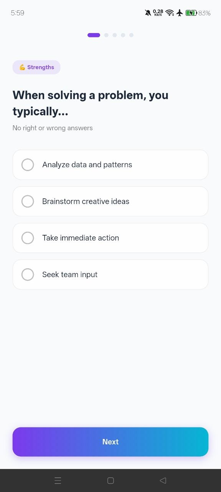
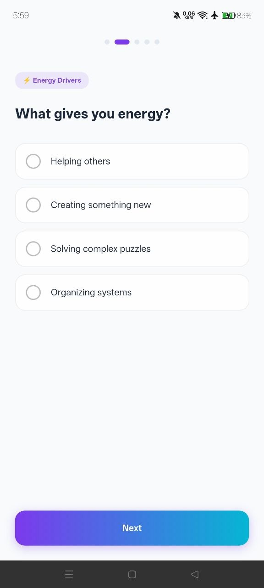
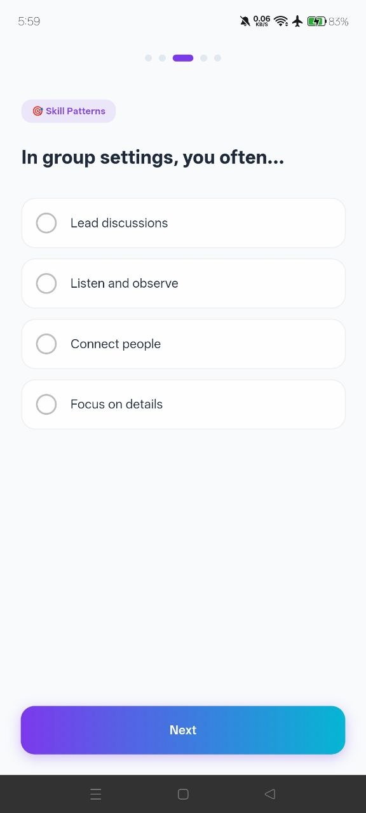
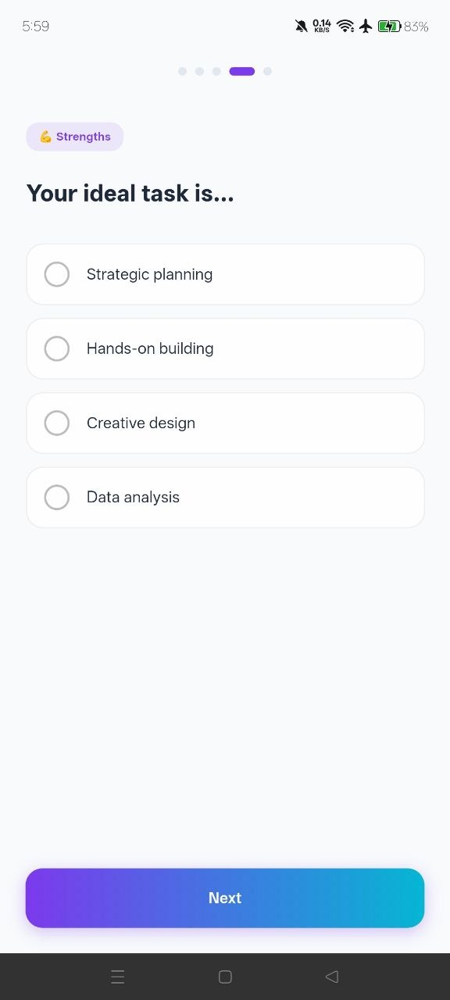
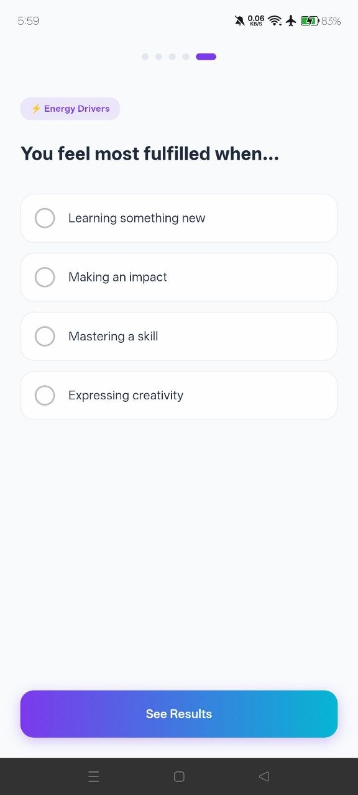
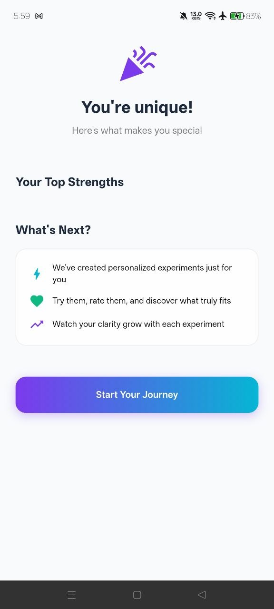
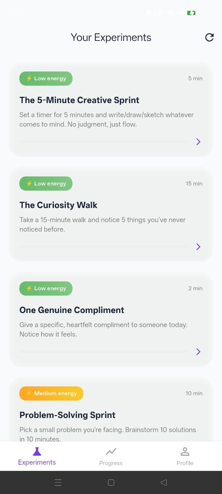
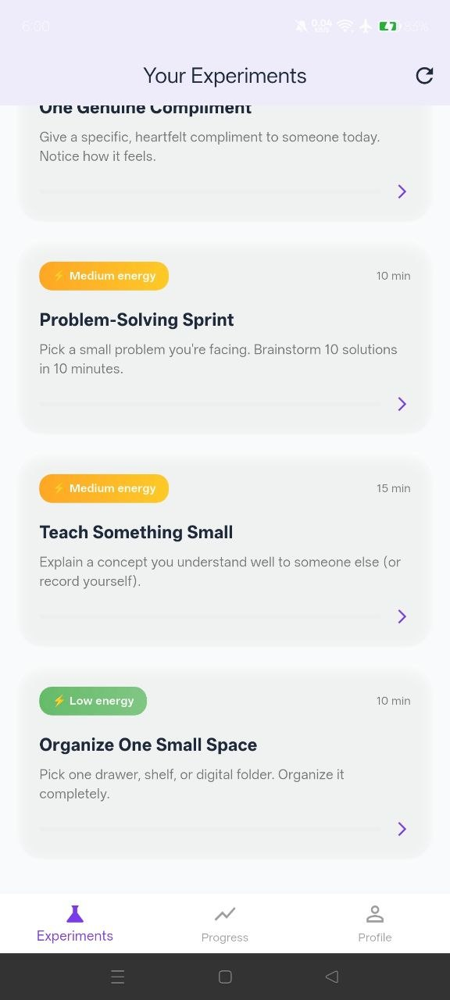
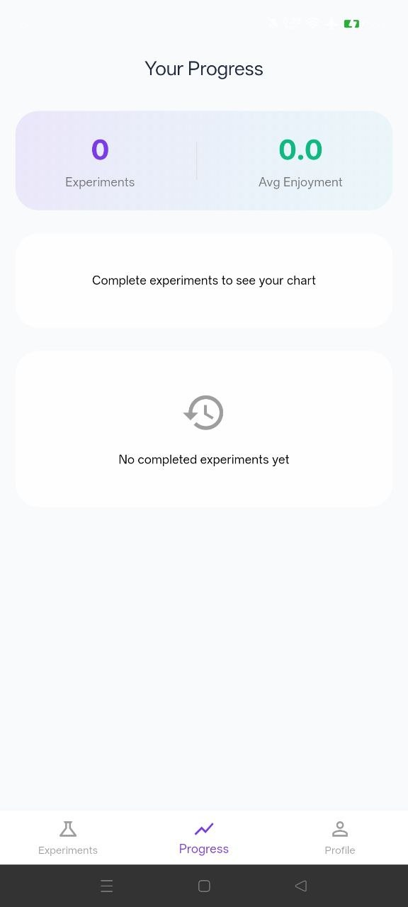
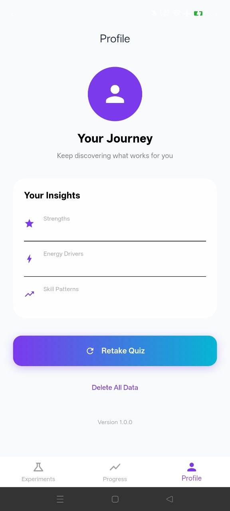

### 2. AI-Powered Personalized Recommendations
**Purpose:** Generate custom real-world experiments based on user's profile

**Features:**
- **Personalization Engine:** Matches experiments to user's top strengths
- **Tiny, Testable Actions:** 2-25 minute experiments
- **Energy-Level Filtering:** Low/Medium/High energy options
- **Dynamic Generation:** New experiments based on user feedback
- **OpenAI-ready architecture:** Can integrate with GPT-4/Claude APIs

**Experiment Examples:**
- "The 5-Minute Creative Sprint" (Low energy, creativity focus)
- "One Genuine Compliment" (Low energy, connection focus)
- "Problem-Solving Sprint" (Medium energy, analysis focus)
- "Deep Work Block" (High energy, discipline focus)

### 3. Real-Time Feedback Loop
**Purpose:** Track what users try, enjoy, and avoid

**Features:**
- **Completion Tracking:** Log when experiments are attempted
- **Enjoyment Rating:** 5-star feedback system
- **Avoidance Patterns:** Track what users consistently skip
- **Behavior Analytics:** Identify patterns over time
- **Automatic Adaptation:** AI adjusts future recommendations

**Data Tracked:**
- Experiment completion status
- Enjoyment ratings (1-5 scale)
- Completion timestamps
- Energy level preferences
- Strength tag correlations

### 4. Progress Dashboard
**Purpose:** Visualize growth and discovery patterns

**Features:**
- **Statistics Cards:** Total experiments completed, average enjoyment
- **Bar Charts:** Weekly enjoyment trends
- **History Timeline:** Recently completed experiments
- **Filtering:** View tried, enjoyed, and avoided experiments
- **Streak Counter:** Motivates consistent engagement

### 5. Glassmorphism UI Design
**Purpose:** Beautiful, modern, calming user experience

**Features:**
- **Frosted Glass Effects:** Backdrop blur for depth
- **Light Mode Optimized:** Clean, airy aesthetic
- **Gradient Buttons:** Purple to cyan gradients
- **Smooth Animations:** Page transitions and micro-interactions
- **Responsive Layout:** Works on all Android screen sizes

**Color Palette:**
- Primary: `#7C3AED` (Purple - Clarity, Wisdom)
- Secondary: `#06B6D4` (Cyan - Energy, Action)
- Tertiary: `#10B981` (Green - Growth, Enjoyment)
- Background: `#F8FAFC` (Off-white - Clean, Calm)

**Features:**
- **SharedPreferences:** Quiz data and settings
- **Experiment Cache:** All generated experiments stored locally
- **Data Privacy:** No cloud storage required (GDPR compliant)

### 6. Profile & Insights Hub
**Purpose:** Review and recalibrate user understanding

**Features:**
- **View Original Results:** See top strengths and patterns
- **Retake Quiz:** Update profile as user grows
- **Data Deletion:** Complete privacy control
- **Version Tracking:** App version display

---

## ✅ Advantages & Pros

### For Users

| Advantage | Description |
|-----------|-------------|
| **Action-Oriented** | Stops analysis paralysis by focusing on small, doable experiments |
| **Zero Overthinking** | No journaling, no endless reflection - just try and learn |
| **Truly Personalized** | AI recommendations adapt to actual behavior, not just quiz answers |
| **Low Barrier to Entry** | 2-5 minute experiments fit into any schedule |
| **Energy-Aware** | Experiments tagged by energy level (Low/Medium/High) |
| **Immediate Feedback** | See enjoyment patterns instantly after each experiment |
| **Privacy First** | All data stored locally - you own your journey |
| **Beautiful Design** | Calming glassmorphism UI reduces cognitive load |
| **Free to Start** | No subscription required for core features |

### For Product/Market Fit

| Advantage | Description |
|-----------|-------------|
| **Solves Real Problem** | Addresses the #1 complaint in self-discovery: "I don't know what I want" |
| **Differentiated** | Not another journaling/meditation app - unique action-based approach |
| **High Retention Potential** | Daily experiments + progress tracking = habit formation |
| **Scalable AI** | Can integrate OpenAI/Claude for unlimited experiment generation |
| **Data-Driven Iteration** | Feedback loop provides clear product improvement signals |
| **Viral Potential** | Shareable results and experiments |

### For Technical Implementation

| Advantage | Description |
|-----------|-------------|
| **Minimal Dependencies** | Only essential packages, easy to maintain |
| **Extensible Architecture** | Clear separation of concerns (models, services, screens) |
| **Ready for Backend** | Can easily add Firebase/Supabase for sync |
| **Cross-Platform** | Flutter codebase supports Android, iOS, Web |
| **Production-Ready** | Error handling, loading states, refresh indicators |

### Psychological Benefits

| Benefit | How Clarity Delivers |
|---------|----------------------|
| **Reduces Decision Fatigue** | AI picks experiments based on user profile |
| **Builds Self-Efficacy** | Small wins build confidence |
| **Creates Discovery Loops** | Try → Rate → Learn → Adapt |
| **Removes Perfectionism** | "Tiny experiments" mindset reduces fear of failure |
| **Increases Self-Awareness** | Pattern recognition over time |
| **Promotes Flow States** | Matched energy levels keep engagement optimal |

---

## 🆚 Comparison vs. Competitors

| Feature | Clarity | Journaling Apps | Personality Tests | Coaching Apps |
|---------|---------|-----------------|-------------------|---------------|
| Action-based | ✅ | ❌ | ❌ | ⚠️ |
| AI Personalization | ✅ | ❌ | ❌ | ✅ |
| Tracks actual behavior | ✅ | ⚠️ | ❌ | ❌ |
| Under 10 min experiments | ✅ | N/A | N/A | ❌ |
| Glassmorphism UI | ✅ | ⚠️ | ❌ | ❌ |
| Free core features | ✅ | ⚠️ | ✅ | ❌ |

---

## 🚀 Future Roadmap

### Phase 2 (Coming Soon)
- [ ] OpenAI integration for unlimited unique experiments
- [ ] Social features (anonymous sharing of discoveries)
- [ ] Weekly insights reports
- [ ] Experiment reminders and notifications
- [ ] Dark mode support

### Phase 3 (Planned)
- [ ] Community-generated experiments
- [ ] Coach/therapist dashboard
- [ ] Export data (CSV/PDF)
- [ ] Voice-guided experiments
- [ ] Mood tracking integration

### Phase 4 (Vision)
- [ ] Group discovery challenges
- [ ] Career path recommendations
- [ ] Skill-building pathways
- [ ] Integration with wearables (heart rate for stress/flow)

---

## 📊 Success Metrics

| Metric | Target |
|--------|--------|
| Quiz completion rate | >85% |
| Experiment completion rate | >60% |
| User retention (Day 7) | >40% |
| User retention (Day 30) | >25% |
| Average experiments/week | 3-5 |
| Enjoyment rating average | >4.0/5.0 |

---

## 🎨 Design Philosophy

Clarity follows **"Calm Technology"** principles:
1. **Low Friction** - Everything is 1-2 taps away
2. **Positive Reinforcement** - Celebration animations, not criticism
3. **No Overwhelm** - One experiment at a time
4. **Privacy by Default** - No data leaves the device unless user chooses
5. **Beautiful Utility** - Form serves function

---

## Screens

---

  
   
  <em>Strengths</em>

---

  
   
  <em>Energy Divers</em>

---

  
   
  <em>Skill Patterns</em>

---

  
   
  <em>Strengths</em>

---

  
   
  <em>Energy Divers</em>

---

  
   
  <em>You're Unique</em>

---

  
   
  <em>Experiments</em>

---

  
   
  <em>Experiments</em>

---

  
   
  <em>Experiments</em>

---

  
   
  <em>Profile</em>

